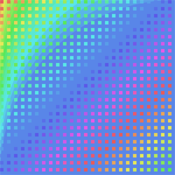

# Tomita Recurrent Neural Network

######Tomita Tsunejirō, the first in the history of judo to be awarded the rank of Shodan by the founder of judo, Kanō Jigorō




A [char-rnn](http://karpathy.github.io/2015/05/21/rnn-effectiveness/) based neural network trained on 10,000 code based artworks created using Kano [Make Art](http://art.kano.me).

## Requirements

This code is written in Lua and requires [Torch](http://torch.ch/). If you're on Ubuntu, installing Torch in your home directory may look something like: 

```bash
$ git clone https://github.com/torch/distro.git ~/torch --recursive
$ cd ~/torch; bash install-deps;
$ ./install.sh
```

See the Torch installation documentation for more details. After Torch is installed we need to get a few more packages using [LuaRocks](https://luarocks.org/) (which already came with the Torch install). In particular:

```bash
$ luarocks install nngraph 
$ luarocks install optim
$ luarocks install nn
```

If you'd like to train on an NVIDIA GPU using CUDA (this can be to about 15x faster), you'll of course need the GPU, and you will have to install the [CUDA Toolkit](https://developer.nvidia.com/cuda-toolkit). Then get the `cutorch` and `cunn` packages:

```bash
$ luarocks install cutorch
$ luarocks install cunn
```

If you'd like to use OpenCL GPU instead (e.g. ATI cards), you will instead need to install the `cltorch` and `clnn` packages, and then use the option `-opencl 1` during training ([cltorch issues](https://github.com/hughperkins/cltorch/issues)):

```bash
$ luarocks install cltorch
$ luarocks install clnn
```

## Usage


```
$ th sample.lua cv/tomita-deep.t7 -gpuid -1 -length 500 -temperature 1 -primetext "background" -seed 1000
```
**Brains** stored in `./cv/` three are included:
- `tomita-1000.t7` - Trained on 1000 artworks
- `tomita-fast.t7` - Trained on 10,000 artworks, outputs faster
- `tomita-deep.t7` - Trained on 10,000 artworks but with deeper settings

**gpuid**. `-gpuid -1` runs on CPU rather than GPU. The brains were trained on CPU so would need converting if you run them on GPU.

**Temperature**. How conservative the output is, 1 is normal. 2 upwards gets *weird*.

**Can use both of these or just one to prime the NN**

**Priming**. It's also possible to prime the model with some starting text using `-primetext`. This starts out the RNN with some hardcoded characters to *warm* it up with some context before it starts generating text. E.g. a fun primetext might be `-primetext "the meaning of life is "`. 

**Seed**. Seed the random number generator

## Scripts

- `ponderDeep` - Just output whatever from tomita-deep
- `ponderFast` - Just output whatever from tomita-fast
- `textGen` - Tries to generate text commands
- `textGen` - Tries to generate color names

## Examples


